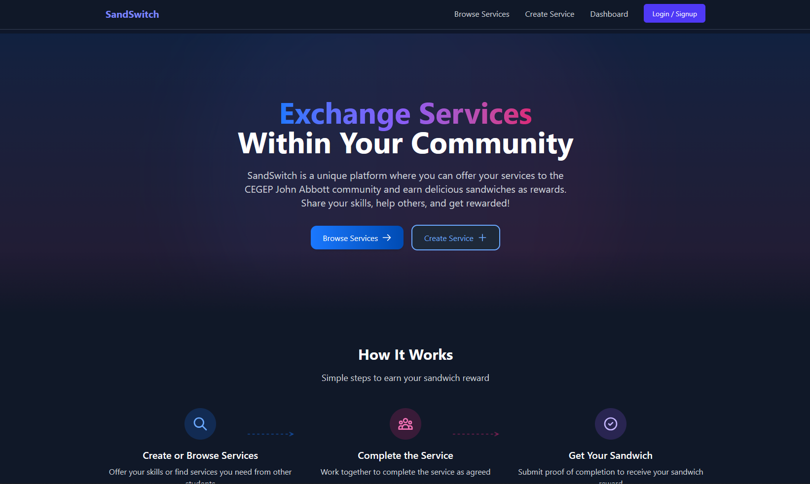

# SandSwitch


A full-stack web application built with Next.js and Firebase, demonstrating a community-based service exchange platform where users trade skills for rewards.

---




## Table of Contents

- [SandSwitch](#sandswitch)
  - [Table of Contents](#table-of-contents)
  - [About The Project](#about-the-project)
  - [Key Features](#key-features)
  - [Tech Stack](#tech-stack)
  - [Architecture \& Design](#architecture--design)
  - [Getting Started](#getting-started)
    - [Prerequisites](#prerequisites)
    - [Installation](#installation)
  - [Usage](#usage)
  - [Technical Challenges \& Lessons Learned](#technical-challenges--lessons-learned)
  - [Future Improvements](#future-improvements)
  - [License](#license)

## About The Project

SandSwitch is a full-stack service exchange platform designed for the CEGEP John Abbott student community. The project was conceptualized to foster a collaborative environment where students can offer their skills—from academic tutoring to creative services—and receive a simple, fun reward: a sandwich.

This application solves the challenge of creating a low-stakes bartering system within a closed community. It provides a centralized hub for students to browse available help, offer their own expertise, manage ongoing exchanges, and communicate in real-time, all within a secure and user-friendly interface. It serves as a comprehensive demonstration of a modern, serverless web application with robust, real-world features.

## Key Features

-   **Full User Authentication:** Secure user registration and login (Email/Password & Google Sign-In) managed by Firebase Authentication, including email verification and password reset flows.
-   **Service Creation & Browsing:** Users can create, edit, and delete service listings, categorized as either "Offerings" or "Requests". A dynamic filtering system allows for easy discovery of services by category, type, or search term.
-   **Matching System:** Users can initiate a "match" to connect with a service provider or requester, creating a dedicated channel for the service exchange.
-   **Real-time Chat:** Once matched, users can communicate through an in-app, real-time messaging system built on Firestore's `onSnapshot` listener, ensuring instant message delivery.
-   **Interactive Dashboard:** A comprehensive user dashboard to manage created services, track all matches (pending, in-progress, completed), and view all conversations in a dedicated messaging UI.
-   **Match Lifecycle Management:** Users can mutually update the status of a match from `Pending` -> `In Progress` -> `Completed`, providing a clear workflow for the service exchange.

## Tech Stack

The project is built with a modern, scalable, and serverless technology stack.

-   **Frontend:**
    -   [React](https://reactjs.org/)
    -   [Next.js](https://nextjs.org/) (App Router)
    -   [Tailwind CSS](https://tailwindcss.com/)
    -   [Framer Motion](https://www.framer.com/motion/) (for animations)
-   **Backend & Database:**
    -   [Firebase](https://firebase.google.com/)
        -   **Firestore:** NoSQL database for storing user data, services, and matches.
        -   **Firebase Authentication:** Handles user identity, session management, and security.
-   **Deployment:**
    -   [Vercel](https://vercel.com/)

## Architecture & Design

SandSwitch is architected as a serverless web application, leveraging Firebase as a Backend-as-a-Service (BaaS).

-   **Client-Side:** The frontend is a Next.js application that handles all UI rendering and user interactions. It communicates directly with Firebase services.
-   **Backend Logic:** All backend operations (database queries, authentication) are handled by the Firebase platform, eliminating the need for a dedicated server.
-   **State Management:** Global application state, such as the current user and Firebase service instances, is managed through a custom React Context (`FirebaseProvider`), ensuring efficient and centralized access to backend services throughout the component tree.
-   **Real-Time Data:** The application achieves real-time functionality for chat and match status updates by subscribing to Firestore document changes using `onSnapshot` listeners. This creates a responsive and interactive user experience without the need for manual polling.

[INSERT ARCHITECTURE DIAGRAM HERE]
> A simple diagram showing the relationship between the Next.js Client, Firebase Auth, and Firestore would be beneficial.

## Getting Started

To get a local copy up and running, follow these simple steps.

### Prerequisites

-   Node.js (v18 or later)
-   pnpm package manager (`npm install -g pnpm`)
-   A Firebase project. See [FIREBASE_SETUP.md](FIREBASE_SETUP.md) for detailed instructions.

### Installation

1.  **Clone the repository:**
    ```sh
    git clone https://github.com/[Your-GitHub-Username]/sandswitch.git
    cd sandswitch
    ```
2.  **Install dependencies:**
    ```sh
    pnpm install
    ```
3.  **Set up environment variables:**
    -   Create a `.env.local` file in the root directory by copying the example file:
        ```sh
        cp .env.local.example .env.local
        ```
    -   Fill in your Firebase project credentials in the `.env.local` file.

4.  **Run the development server:**
    ```sh
    pnpm run dev
    ```
    The application will be available at `http://localhost:3000`.

## Usage

1.  **Register an Account:** Sign up using your email and password or with a Google account. You will receive a verification email.
2.  **Verify Your Email:** Click the link in the verification email to activate your account.
3.  **Create a Service:** Navigate to the "Create Service" page to offer a skill or request help.
4.  **Browse and Match:** Go to the "Browse Services" page to find a service you're interested in. Click "Request This Service" or "Offer Help" to create a match.
5.  **Chat and Manage:** Use the Dashboard to manage your matches and communicate with other users in real-time.

## Technical Challenges & Lessons Learned

This project presented several technical challenges that provided significant learning opportunities.

1.  **Real-Time State Management for Chat & Matches**
    -   **Problem:** Ensuring that chat messages and match status updates are reflected instantly for both users involved in an exchange is crucial for a good user experience. Relying on manual fetching would be inefficient and slow.
    -   **Solution:** I leveraged Firebase Firestore's real-time listeners (`onSnapshot`) to subscribe to changes in match documents. When a message is added or a status is updated, Firestore pushes the new data to all subscribed clients automatically. This logic is encapsulated within the `firebaseContext.js` and `firebaseService.js` to create a reactive data layer for the entire application.
    -   **What I Learned:** This project provided deep, practical experience in designing and building real-time applications. I learned how to structure data in Firestore for efficient real-time queries and how to manage component lifecycle and state in response to asynchronous data streams.

2.  **Complex State Logic for the Match Lifecycle**
    -   **Problem:** A "match" is not a simple state; its lifecycle (`pending` -> `in-progress` -> `completed`) depends on actions from two independent users (the requester and provider). For example, a match only becomes "in-progress" after both users confirm they have started. This required careful state management to prevent race conditions and ensure data consistency.
    -   **Solution:** I designed a robust state model within Firestore documents, using boolean flags like `requesterStarted` and `providerStarted`. The business logic for state transitions was encapsulated in dedicated functions within `firebaseService.js` (e.g., `updateMatchStart`). These functions atomically read the current state, apply the user's action, and determine if the overall match status should be updated, ensuring predictable and reliable state changes.
    -   **What I Learned:** I gained valuable skills in modeling complex, multi-actor business logic in a serverless environment. This demonstrates an ability to think through state transitions, design a resilient database schema, and write clean, maintainable code to manage application state.

## Future Improvements

-   **User Rating and Review System:** Implement a feature allowing users to rate and review each other after a match is completed to build trust within the community.
-   **Real-time Notifications:** Integrate Firebase Cloud Messaging (FCM) to send push notifications for new messages, match requests, and status updates, improving user engagement.
-   **Advanced Search with Algolia:** Replace the basic Firestore search with a dedicated search service like Algolia for faster, more powerful full-text search capabilities.
-   **Refactor to TypeScript:** Migrate the codebase from JavaScript to TypeScript to enhance type safety, improve code quality, and make the project more scalable and maintainable.

## License

Distributed under the MIT License. See `LICENSE` for more information.